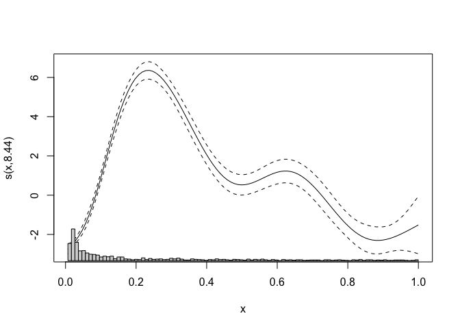
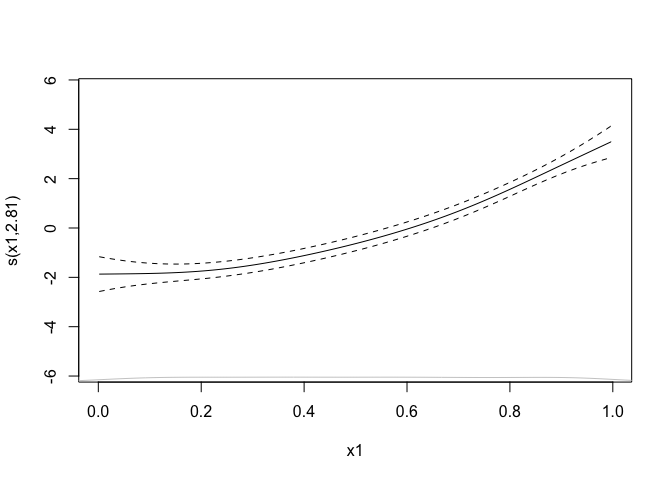

Alternatives to rug plots for smooths
=====================================

What are some alternative ways to plot the rug plots at the bottom of
1-D smooth plots?

First, fitting an example model:

    library(mgcv)

    ## Loading required package: nlme

    ## This is mgcv 1.8-33. For overview type 'help("mgcv-package")'.

    set.seed(233)
    dat <- gamSim(1,n=400,dist="normal",scale=2)

    ## Gu & Wahba 4 term additive model

    b <- gam(y~s(x0)+s(x1)+s(x2)+s(x3),data=dat)

And another where there’s more sampling at one end and it’s hard to see
what’s happening:

    # test function
    f2 <- function(x) 0.2 * x^11 * (10 * (1 - x))^6 + 10 *
                (10 * x)^3 * (1 - x)^10
    # sample x
    x <- exp(5*runif(1000))
    x <- x/max(x)
    #plot(x, f2(x))
    #rug(x)
    dat2 <- data.frame(x=x, f2=f2(x), y=f2(x)+rnorm(1000, 0, 2))

    b2 <- gam(y~s(x),data=dat2)

Default plotting
----------------

    par(mfrow=c(1,2))
    plot(b, select=2)
    plot(b2)

Making the rug semi-transparent
-------------------------------

    library(grDevices)

    grey_t <- adjustcolor("grey80", alpha.f=0.3)

    par(mfrow=c(1,2))
    plot(b, select=2, rug=FALSE)
    rug(dat$x2, col=grey_t)
    plot(b2, rug=FALSE)
    rug(dat2$x, col=grey_t)

Mini histogram
--------------

    plot(b, select=2, rug=FALSE)

    oo <- par()
    # find out bounding for the plot
    u <- par("usr")
    # convert coordinates
    v <- c(
      grconvertX(u[1:2], "user", "ndc"),
      grconvertY(u[3:4], "user", "ndc")
    )
    # bounding box for the histogram
    v <- c(v[1], v[2], v[3], v[3] + (v[4]+v[3])*0.1)
    # set plot area, no margins
    oo <- par(fig=v, new=TRUE, mar=c(0,0,0,0))
    # add histogram
    hist(dat$x2, axes=FALSE, xlab="", ylab="", main="", breaks=100)

    par(oo)

    plot(b2, rug=FALSE)
    # find out bounding for the plot
    u <- par("usr")
    v <- c(
      grconvertX(u[1:2], "user", "ndc"),
      grconvertY(u[3:4], "user", "ndc")
    )
    v <- c(v[1], v[2], v[3], v[3] + (v[4]+v[3])*0.1)
    par(fig=v, new=TRUE, mar=c(0,0,0,0) )
    hist(dat2$x, axes=FALSE, xlab="", ylab="", main="", breaks=100)

    par(oo)

We can make this a bit prettier:

    # get a nice semi-transparent grey
    library(grDevices)
    grey_t <- adjustcolor("grey80", alpha.f=0.5)

    plot(b, select=2, rug=FALSE)

    oo <- par()
    # find out bounding for the plot
    u <- par("usr")
    # convert coordinates
    v <- c(
      grconvertX(u[1:2], "user", "ndc"),
      grconvertY(u[3:4], "user", "ndc")
    )
    # bounding box for the histogram (0.1 gives the relative height)
    v <- c(v[1], v[2], v[3], v[3] + (v[4]+v[3])*0.1)
    # set plot area, no margins
    oo <- par(fig=v, new=TRUE, mar=c(0,0,0,0))
    # add histogram
    hist(dat$x2, axes=FALSE, xlab="", ylab="", main="", breaks=100,
         col=grey_t, border=NA)

    par(oo)

    plot(b2, rug=FALSE)
    # find out bounding for the plot
    u <- par("usr")
    v <- c(
      grconvertX(u[1:2], "user", "ndc"),
      grconvertY(u[3:4], "user", "ndc")
    )
    v <- c(v[1], v[2], v[3], v[3] + (v[4]+v[3])*0.1)
    par(fig=v, new=TRUE, mar=c(0,0,0,0) )
    hist(dat2$x, axes=FALSE, xlab="", ylab="", main="", breaks=100,
         col=grey_t, border=NA)

    par(oo)

Mini image plot
===============

Binning a problem

    plot(b, select=2, rug=FALSE)

    # find out bounding for the plot so we know where the bottom is
    u <- par("usr")
    # use the histogram function to generate counts in boxes
    hh <- hist(dat$x2, plot=FALSE, breaks=100)
    # plot that!
    image(z=matrix(hh$count, ncol=1), x=hh$mids, axes=FALSE, add=TRUE,
          y=c(u[3], u[3]+0.2), zlim=c(0, max(hh$count)))

    plot(b2, rug=FALSE)
    # find out bounding for the plot so we know where the bottom is
    u <- par("usr")
    # use the histogram function to generate counts in boxes
    hh <- hist(dat2$x, plot=FALSE, breaks=100)
    # plot that!
    image(z=matrix(hh$count, ncol=1), x=hh$mids, axes=FALSE, add=TRUE,
          y=c(u[3], u[3]+0.2), zlim=c(0, max(hh$count)))

Mini density
============

Edge effects are a problem here

    plot(b, select=2, rug=FALSE)

    # find out bounding for the plot so we know where the bottom is
    u <- par("usr")
    # do a kernel density estimate, lots to fiddle with here!
    hh <- density(dat$x2)
    # plot that!
    lines(hh$x, u[3]+(hh$y/max(hh$y))*0.2, col="grey80")

    plot(b2, rug=FALSE)
    # find out bounding for the plot so we know where the bottom is
    u <- par("usr")
    # do a kernel density estimate, lots to fiddle with here!
    hh <- density(dat2$x)
    # plot that!
    lines(hh$x, u[3]+(hh$y/max(hh$y)), col="grey80")

